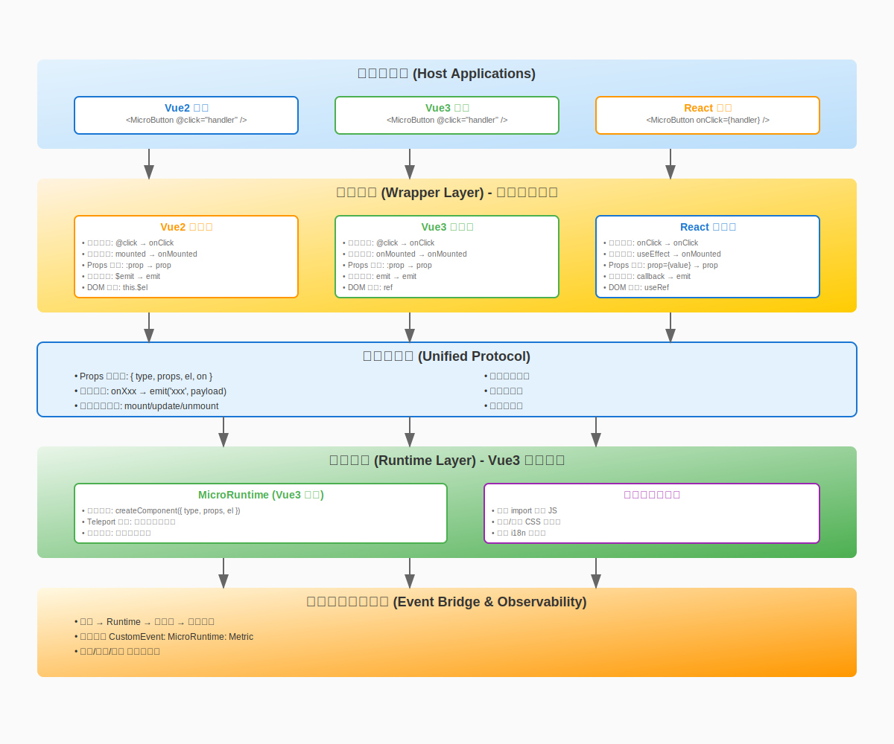
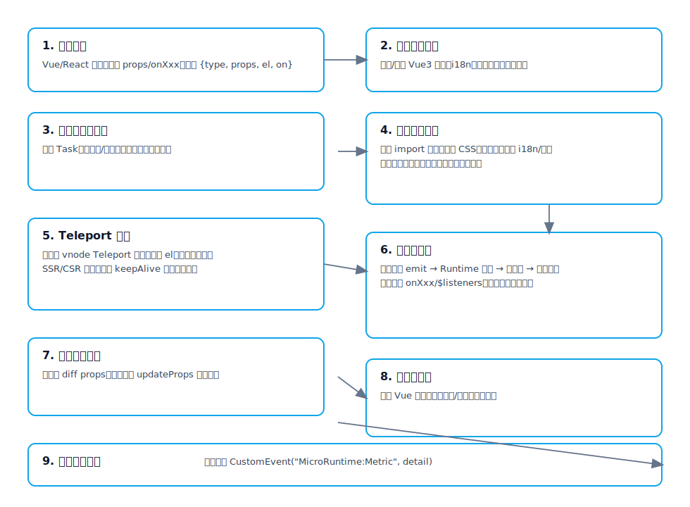

# Micro Components —— 跨栈微组件系统（单文档版）

一个以 Vue 3 为内核，支持在 Vue 2、Vue 3 与 React 中统一复用的微组件系统。本文是整合并优化后的唯一 README，完整阐述项目结构、运行原理、全链路流转过程与使用方法。

—— 你可以把它理解为：一次开发（Vue3 语法），通过构建生成三端包装器（Vue2/Vue3/React），再由运行时（Runtime）统一完成挂载、通信、状态与样式管理。


## 目录
- 特性速览
- 项目结构
- 核心概念
- 组件配置系统
- 运行原理
- 快速开始与用法
- 构建与产物
- 调试与性能观测
- 常见问题


## 特性速览
- 跨栈复用：一次开发，三端可用（Vue2/Vue3/React）
- 按需加载：组件、样式、语言包与数据并行加载
- 事件通信：统一事件桥，跨框架一致的事件语义
- 国际化：运行时语言切换与 SSR 语言包
- 主题与样式：统一的样式注入与就绪检测
- 任务队列：基于优先级的组件调度与并发管理
- 稳定性：超时保护、降级对象与完善卸载
- 可观测：内置调试日志与性能指标事件


## 项目结构（关键目录）
- runtime/ 运行时核心（容器、调度、i18n、配置）
- src/components/* 业务组件（统一以 Vue3 语法实现）
- scripts/ 构建脚本（为三端生成包装器与运行时产物）
- template/{vue|vue2|react} 三端包装器模板
- locales/ 国际化资源
- dist/ 构建产物（runtime 与各端组件）

### 开发与测试环境
- **playground/** - 快速开发调试环境，提供简单的 HTML 页面用于测试单个组件的基本功能和样式
- **test-projects/** - 完整的测试项目集合，包含 Vue2、Vue3 和 React 三个独立项目，用于验证组件在真实项目环境中的集成效果和跨框架兼容性
- **storybook/** - 组件文档和展示平台，提供交互式的组件预览、API 文档、使用示例和设计规范，是组件库的官方文档站点


## 核心概念
- 组件（Component）：以 Vue3 语法实现的业务组件，如 Footer
- 包装器（Wrapper）：面向不同宿主框架的外层适配（Vue2/Vue3/React）
- 运行时（Runtime）：统一的调度与渲染中枢，负责组件创建、样式注入、事件桥与资源加载
- 任务（Task）：一次组件创建过程的抽象，带有优先级、状态与生命周期
- 配置系统（Config System）：多层次的配置合并机制，支持默认配置、基础配置和用户自定义配置的智能合并


## 组件配置系统

### 配置层次结构

组件配置系统采用三层架构，按优先级从低到高依次为：

1. **默认配置（Default Config）**
   - 组件的基础配置，定义在各组件的 `useComponent.ts` 文件中
   - 包含组件运行所需的最小配置集合
   - 提供合理的默认值，确保组件在无配置情况下正常工作

2. **基础配置（Source Config）**
   - 来自上层组件、全局配置或 ConfigProvider 的配置
   - 通常用于设置项目级别的通用配置
   - 可以覆盖默认配置中的部分或全部字段

3. **用户配置（Target Config）**
   - 组件实例级别的自定义配置
   - 具有最高优先级，可以覆盖前两层的任何配置
   - 通过组件 props 传入

### 配置合并策略

配置合并遵循以下规则：

```javascript
// 合并优先级：用户配置 > 基础配置 > 默认配置
finalConfig = { ...defaultConfig, ...sourceConfig, ...targetConfig }

// 特殊处理数组类型配置（如 links、languages 等）
// 采用完全替换策略，而非数组合并
productLinks = targetConfig.productLinks || sourceConfig.productLinks || defaultConfig.productLinks
```

### 配置示例

以 Footer 组件为例：

```javascript
// 1. 默认配置
const defaultConfig = {
  brandName: 'MicroApp',
  slogan: 'Simple & Powerful',
  copyright: '© 2025 MicroApp. All rights reserved.',
  i18nEnabled: true,
  productLinks: [
    { title: 'Features', url: '/features', target: '_self' },
    { title: 'Pricing', url: '/pricing', target: '_self' }
  ],
  supportLinks: [
    { title: 'Help Center', url: '/help', target: '_self' },
    { title: 'Contact Us', url: '/contact', target: '_self' }
  ],
  socialLinks: [
    { name: 'twitter', title: 'Follow us on Twitter', url: 'https://twitter.com/microapp' }
  ],
  languages: [
    { locale: 'en', languageKey: 'en_US', languageName: 'English' },
    { locale: 'zh-CN', languageKey: 'zh_CN', languageName: '简体中文' }
  ]
}

// 2. 基础配置（来自 ConfigProvider 或全局设置）
const sourceConfig = {
  brandName: 'MyCompany',
  rtlSupport: false,
  project: 'main'
}

// 3. 用户配置（组件实例传入）
const targetConfig = {
  brandName: 'CustomBrand',
  slogan: '自定义标语 - 创新科技，引领未来',
  copyright: '© 2024 CustomBrand. 保留所有权利。',
  productLinks: [
    { title: '产品介绍', url: '/products', target: '_self' },
    { title: '解决方案', url: '/solutions', target: '_self' }
  ]
}

// 4. 最终合并结果
const finalConfig = {
  brandName: 'CustomBrand',           // 来自用户配置
  slogan: '自定义标语 - 创新科技，引领未来', // 来自用户配置
  copyright: '© 2024 CustomBrand. 保留所有权利。', // 来自用户配置
  i18nEnabled: true,                  // 来自默认配置
  rtlSupport: false,                  // 来自基础配置
  project: 'main',                    // 来自基础配置
  productLinks: [                     // 来自用户配置（完全替换）
    { title: '产品介绍', url: '/products', target: '_self' },
    { title: '解决方案', url: '/solutions', target: '_self' }
  ],
  supportLinks: [                     // 来自默认配置（未被覆盖）
    { title: 'Help Center', url: '/help', target: '_self' },
    { title: 'Contact Us', url: '/contact', target: '_self' }
  ],
  socialLinks: [                      // 来自默认配置（未被覆盖）
    { name: 'twitter', title: 'Follow us on Twitter', url: 'https://twitter.com/microapp' }
  ],
  languages: [                        // 来自默认配置（未被覆盖）
    { locale: 'en', languageKey: 'en_US', languageName: 'English' },
    { locale: 'zh-CN', languageKey: 'zh_CN', languageName: '简体中文' }
  ]
}
```
### 配置验证

系统内置配置验证机制，确保配置的正确性：

- **必填字段检查**：验证关键配置项是否存在
- **类型验证**：确保配置项类型正确（如数组类型的 links）
- **格式验证**：检查链接格式、语言配置等是否符合规范
- **警告提示**：对可能的配置问题给出友好提示

配置验证会在组件初始化时自动执行，开发模式下会在控制台输出详细的验证结果。


## 运行原理
以下按“从调用到渲染完成”的时间线展开，展示一次组件完整流转。

1) 宿主侧调用
- Vue2/Vue3/React 宿主通过对应包装器使用组件（或直接通过全局 MicroRuntime#createComponent 调用）
- 包装器只做一件事：把宿主的 props/事件，映射为统一协议，交给运行时

2) 运行时准备
- 首次使用时创建并挂载一个隐藏的 Vue3 应用（Runtime 容器）
- 初始化国际化（i18n）、运行配置与事件中心
- 暴露 window.MicroRuntime 供外部直接调度

3) 任务入队（优先级调度）
- 每次创建组件会生成 Task：包含 type、props、挂载目标 el、优先级等
- 调度器会按优先级与并发策略出队执行，避免大量组件同时竞争资源

4) 并行拉取资源
- 并发执行：
  - 动态加载组件代码（基于 import/chunk）
  - 加载/合并语言包（locales）
  - 预取数据（按组件 config.prefetch 策略）
  - 注入并等待样式就绪（runtime.css/组件样式）
- 具备缓存策略：已加载的组件与样式二次复用，避免重复网络请求

5) 容器与 Teleport 渲染
- Runtime.vue 内部为每个组件分配稳定的容器节点
- 使用 Vue Teleport 将真实 DOM 渲染到宿主给定的 el 上
- 这使得“跨框架挂载”成为可能：外壳可以是 React/Vue2，但真实渲染由 Runtime 控制

6) 事件桥与双向通信
- 运行时为每个组件建立事件总线（EventEmitter）
- 组件内部 emit('eventName', payload) 后，包装器在宿主侧以统一命名派发
  - Vue3：onXxx 回调
  - Vue2：$listeners
  - React：onXxx props

7) 属性更新与重渲染
- 包装器监听宿主 props 变化，调用组件实例的 updateProps 进行增量更新
- 运行时负责最小化重渲染与状态保持（可配置 keepAlive）

8) 卸载与清理
- removeComponent 会等待 Vue 完整卸载
- 清理容器 DOM 属性、类名与事件监听，防止泄漏

9) 稳定性与超时保护
- 所有关键阶段都带有超时（例如 30s）与 AbortController 中断
- 失败则返回降级对象 { updateProps: () => {} }，宿主不崩溃

10) 可观测与性能指标
- 若开启调试（localStorage.MICRO_COMPONENT:DEBUG=true），会输出各阶段耗时
- 并通过浏览器事件 MicroRuntime:Metric 发送指标，便于外部采集

### 运行原理（图解版）

这套体系的目标：让“不同技术栈（Vue2/Vue3/React）的宿主项目”，都能像使用本地组件一样使用 micro-component 提供的统一组件，不需要关心内部实现用的是什么框架。

1) 我们如何抹平各技术栈差异
- 统一协议层：不论你在 Vue2/Vue3 还是 React 中使用，包装器都会把外部传入的参数转换为一个统一对象：{ type, props, el, on }。
  - type：要创建的组件类型（例如 Footer）。
  - props：普通、可序列化的数据（对象/数组/字符串/数字/布尔/日期字符串等）。
  - el：一个真实 DOM 容器（包装器会拿到真实 DOM，交给运行时）。
  - on：一组回调，统一表现为 onXxx（例如 onClick、onChange）。
- 事件桥（Event Bridge）：
  - Vue3 的 @click、Vue2 的 $listeners、React 的 onClick，本质都是“事件回调”。包装器把这些都收敛为统一的 onXxx 回调列表交给运行时；组件内部只需要 emit("xxx", payload) 即可。
  - 这样组件侧无需知道“外面是 React 还是 Vue”，事件照常工作。
- 生命周期对齐：
  - 宿主侧只有三件事：mount（创建）、update（属性变化）、unmount（卸载）。
  - Vue2/Vue3/React 包装器都把各自的生命周期映射为这三步，并调用运行时对应的 API。
- 插槽/children：
  - 在需要插槽/children 的场景，包装器把它们转换为“可序列化数据或渲染描述”，统一作为 props 传入；组件内部按约定渲染。
- 样式与主题：
  - 运行时负责把组件的样式（CSS）注入到页面中，并做去重；不依赖宿主使用什么打包器。

2) 浏览器实际是怎么解析/执行的
- 模块解析：
  - 你在宿主里写 import { Footer } from 'micro-components/react/Footer'（或 Vue2/Vue3 对应路径），打包器会把它编译成对“包装器代码”的引用。
  - 运行时在创建组件时，会使用动态 import 去加载真正的组件实现（按需加载）。
- 网络加载与并发：
  - 浏览器并行发起请求：组件 JS、样式、i18n 语言包、可能的预取数据。
  - 命中缓存会快速返回；运行时内部也会做二级缓存，避免重复注入样式或重复 import。
- 渲染与 Teleport：
  - 运行时基于 Vue3 作为“统一渲染内核”。
  - 通过 Vue3 的 Teleport，把组件的真实 DOM 渲染到你传进来的 el 里。这样外部不管是 React、Vue2 还是 Vue3，最终都只是提供一个 DOM 容器而已。
- 事件循环与回调：
  - 组件内部 emit 事件后，运行时经由事件桥把它派发给包装器，包装器再触发宿主提供的 onXxx 回调（或 @xxx / $listeners）。
- 更新与卸载：
  - props 变化时，包装器做浅比较并调用实例的 updateProps；运行时按需最小重渲染，支持 keepAlive 保持内部状态。
  - 卸载时，等待 Vue 完整卸载，移除样式与事件，保证不泄漏。
- 可观测与稳定性：
  - 每个阶段都有超时/降级策略；并用 CustomEvent("MicroRuntime:Metric") 上报关键耗时指标，方便你在宿主侧统一采集。

3) 图解
- 架构总览（包装器 → 统一协议 → 运行时）：

  

- 全链路生命周期（从创建到卸载）：

  


## 快速开始与用法
1) 安装与构建
- pnpm i
- pnpm run build（一次性构建 runtime 与三端组件包装器）

2) 在 Vue 3 使用
- import { MicroFooter } from 'micro-components/vue/Footer'
- 以常规组件方式传入 props，并通过 @xxx 监听事件

3) 在 Vue 2 使用
- import MicroFooter from 'micro-components/vue2/Footer'
- 通过 props 与 $listeners 使用

4) 在 React 使用
- import { Footer } from 'micro-components/react/Footer'
- 以 JSX props 传参，以 onXxx 回调接收事件

5) 直接使用运行时 API（进阶）
- window.MicroRuntime.createComponent({ type, props, el })
- 返回组件实例，支持 updateProps 与 remove


## 构建与产物
- 核心脚本：
  - scripts/build-runtime.ts：构建运行时（runtime.js/css）
  - scripts/build-vue3.ts / build-vue2.ts / build-react.ts：为每个组件生成三端包装器
  - scripts/build-server-locales.ts：生成 SSR 语言包
- 产物结构（dist/）：
  - runtime/：runtime.js、runtime.css
  - components/vue|vue2|react：各端组件入口与类型
  - server-locales/：按语言拆分的 SSR 资源


## 调试与性能观测
- 启用调试：localStorage.setItem('MICRO_COMPONENT:DEBUG', 'true')
- 监听性能指标：window.addEventListener('MicroRuntime:Metric', e => console.log(e.detail))
- 常见日志：fetchMs/prefetchMs/styleReadyMs/mountedMs/keepAliveMs


## 常见问题（FAQ）
- Q: 为什么要 Teleport？
  A: 让 Runtime 统一控制渲染，天然跨框架，宿主只需提供挂载点。
- Q: 事件如何统一？
  A: 组件内部只关心 emit，包装器按宿主框架约定转换为 onXxx 或 $listeners。
- Q: 运行时 CSS/JS 如何注入？
  A: 构建后由运行时按需注入并等待就绪，防止“先渲染后样式”的闪烁。
- Q: 如何保证稳定？
  A: 超时/中断/降级对象三重保障，任何阶段失败都不影响宿主可用性。

—— 若需深入实现，请阅读 runtime/runtime.ts、runtime/Runtime.vue 与 scripts/*。这三者正对应本文的“调度/渲染/构建”三大职责。
