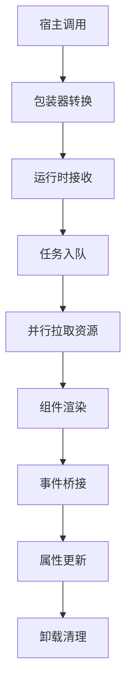

# Micro Components —— 跨栈微组件系统

一个以 Vue 3 为内核，支持在 Vue 2、Vue 3 与 React 中统一复用的微组件系统。通过统一的运行时调度、跨框架事件桥与样式系统，实现"一次开发，三端可用"的微前端组件解决方案。

**核心理念**：你可以把它理解为一次开发（Vue3 语法），通过构建生成三端包装器（Vue2/Vue3/React），再由运行时（Runtime）统一完成挂载、通信、状态与样式管理。


## 目录
- [特性速览](#特性速览)
- [项目结构](#项目结构)
- [核心概念](#核心概念)
- [组件配置系统](#组件配置系统)
- [运行原理](#运行原理)
- [快速开始与用法](#快速开始与用法)
- [构建与产物](#构建与产物)
- [样式系统与一致性保证](#样式系统与一致性保证)
- [组件加载与调度优化](#组件加载与调度优化)
- [事件通信与调试](#事件通信与调试)
- [调试与性能观测](#调试与性能观测)
- [常见问题](#常见问题)

## 特性速览
- **跨栈复用**：一次开发，三端可用（Vue2/Vue3/React）
- **按需加载**：组件、样式、语言包与数据并行加载
- **事件通信**：统一事件桥，跨框架一致的事件语义
- **国际化**：运行时语言切换与 SSR 语言包
- **主题与样式**：统一的样式注入、UnoCSS集成与就绪检测
- **智能调度**：基于优先级的组件调度与并发管理，优化多组件场景
- **稳定性**：超时保护、降级对象与完善卸载
- **可观测**：内置调试日志与性能指标事件

## 项目结构

### 核心目录
```
runtime/              # 运行时核心（容器、调度、i18n、配置）
src/components/*      # 业务组件（统一以 Vue3 语法实现）
scripts/              # 构建脚本（为三端生成包装器与运行时产物）
template/             # 三端包装器模板
├── vue/              # Vue3 包装器模板
├── vue2/             # Vue2 包装器模板  
└── react/            # React 包装器模板
locales/              # 国际化资源
dist/                 # 构建产物（runtime 与各端组件）
```

### 开发与测试环境
- **playground/** - 快速开发调试环境，提供简单的 HTML 页面用于测试单个组件的基本功能和样式
- **test-projects/** - 完整的测试项目集合，包含 Vue2、Vue3 和 React 三个独立项目，用于验证组件在真实项目环境中的集成效果和跨框架兼容性
- **storybook/** - 组件文档和展示平台，提供交互式的组件预览、API 文档、使用示例和设计规范，是组件库的官方文档站点


## 核心概念
- **组件（Component）**：以 Vue3 语法实现的业务组件，如 Footer、Button
- **包装器（Wrapper）**：面向不同宿主框架的外层适配（Vue2/Vue3/React）
- **运行时（Runtime）**：统一的调度与渲染中枢，负责组件创建、样式注入、事件桥与资源加载
- **任务（Task）**：一次组件创建过程的抽象，带有优先级、状态与生命周期
- **配置系统（Config System）**：多层次的配置合并机制，支持默认配置、基础配置和用户自定义配置的智能合并
- **实例标识（Instance ID）**：确保每个组件实例唯一性的标识符，解决多实例场景下的冲突问题

## 组件配置系统

### 配置层次结构

组件配置系统采用三层架构，按优先级从低到高依次为：

1. **默认配置（Default Config）**
   - 组件的基础配置，定义在各组件的 `useComponent.ts` 文件中
   - 包含组件运行所需的最小配置集合
   - 提供合理的默认值，确保组件在无配置情况下正常工作

2. **基础配置（Source Config）**
   - 来自上层组件、全局配置或 ConfigProvider 的配置
   - 通常用于设置项目级别的通用配置
   - 可以覆盖默认配置中的部分或全部字段

3. **用户配置（Target Config）**
   - 组件实例级别的自定义配置
   - 具有最高优先级，可以覆盖前两层的任何配置
   - 通过组件 props 传入

### 配置合并策略

```javascript
// 合并优先级：用户配置 > 基础配置 > 默认配置
finalConfig = { ...defaultConfig, ...sourceConfig, ...targetConfig }

// 特殊处理数组类型配置（如 links、languages 等）
// 采用完全替换策略，而非数组合并
productLinks = targetConfig.productLinks || sourceConfig.productLinks || defaultConfig.productLinks
```

### 方向控制属性

组件支持完整的方向控制功能：
- `direction: 'ltr' | 'rtl'` - 控制组件布局方向（默认为 `'ltr'`）
- `directionSwitchEnabled: boolean` - 是否显示方向切换开关（默认为 `false`）

## 运行原理

### 跨框架抹平机制

#### 1. 统一协议层
不论在 Vue2/Vue3 还是 React 中使用，包装器都会把外部传入的参数转换为统一对象：
```javascript
{
  type: 'Footer',           // 组件类型
  props: { ... },           // 可序列化的数据
  el: HTMLElement,          // 真实 DOM 容器
  on: { onXxx: Function }   // 统一的事件回调
}
```

#### 2. 事件桥（Event Bridge）
- Vue3 的 `@click`、Vue2 的 `$listeners`、React 的 `onClick` 统一转换为 `onXxx` 回调
- 组件内部只需要 `emit("xxx", payload)` 即可跨框架工作
- 运行时自动处理事件类型转换和参数传递

#### 3. 渲染与 Teleport
- 运行时基于 Vue3 作为"统一渲染内核"
- 通过 Vue3 的 Teleport，把组件的真实 DOM 渲染到外部提供的容器中
- 外部框架只需提供一个 DOM 容器，无需关心内部实现

### 完整流转流程



1. **宿主侧调用** - Vue2/Vue3/React 通过对应包装器使用组件
2. **运行时准备** - 创建并挂载隐藏的 Vue3 应用作为 Runtime 容器
3. **智能调度** - 按优先级和实例唯一性管理组件创建队列
4. **并行资源加载** - 并发加载组件代码、样式、语言包和预取数据
5. **Teleport 渲染** - 使用 Vue Teleport 将真实 DOM 渲染到宿主容器
6. **事件通信** - 建立双向事件桥，处理跨框架事件传递
7. **生命周期管理** - 属性更新、重渲染与完善的卸载清理

## 快速开始与用法

### 1. 安装与构建
```bash
pnpm i
pnpm run build          # 构建 runtime 与三端组件包装器
# 可选：pnpm run build:ssr  # 生成 SSR 相关产物
```

### 2. 在 Vue 3 使用
```vue
<template>
  <MicroFooter 
    :direction="'rtl'" 
    :directionSwitchEnabled="true"
    @direction-change="handleDirectionChange"
    @language-change="handleLanguageChange"
  />
</template>

<script setup>
import { MicroFooter } from 'micro-components/vue/Footer'

const handleDirectionChange = (direction) => {
  console.log('Direction changed:', direction)
}
</script>
```

### 3. 在 Vue 2 使用
```vue
<template>
  <MicroFooter 
    :direction="direction"
    :directionSwitchEnabled="true"
    @direction-change="handleDirectionChange"
  />
</template>

<script>
import MicroFooter from 'micro-components/vue2/Footer'

export default {
  components: { MicroFooter },
  data() {
    return { direction: 'ltr' }
  },
  methods: {
    handleDirectionChange(direction) {
      this.direction = direction
    }
  }
}
</script>
```

### 4. 在 React 使用
```jsx
import React from 'react'
import { Footer } from 'micro-components/react/Footer'

function App() {
  const handleDirectionChange = (direction) => {
    console.log('Direction changed:', direction)
  }

  return (
    <Footer 
      direction="rtl"
      directionSwitchEnabled={true}
      onDirectionChange={handleDirectionChange}
    />
  )
}
```

### 5. 直接使用运行时 API（进阶）
```javascript
const component = await window.MicroRuntime.createComponent({
  type: 'Footer',
  props: { theme: 'dark' },
  el: document.getElementById('footer-container')
})

// 更新属性
component.updateProps({ theme: 'light' })

// 卸载组件
component.remove()
```

## 构建与产物

### 核心脚本
- `scripts/build-runtime.ts`：构建运行时（runtime.js/css）
- `scripts/build-vue3.ts / build-vue2.ts / build-react.ts`：为每个组件生成三端包装器
- `scripts/build-server-locales.ts`：生成 SSR 语言产物
- `scripts/create-component.ts`：基于模板创建新组件

### 产物结构
```
dist/
├── runtime/                    # 运行时核心
│   ├── runtime.js             # 调度与渲染逻辑
│   └── runtime.css            # 基础样式
├── components/                 # 各端组件
│   ├── vue/                   # Vue3 组件包装器
│   ├── vue2/                  # Vue2 组件包装器
│   └── react/                 # React 组件包装器
└── server-locales/             # SSR 语言包（可选）
```

## 样式系统与一致性保证

### UnoCSS 集成方案

为了确保所有测试环境中的组件样式完全一致，项目采用了统一的 UnoCSS 集成方案：

#### 1. Playground 环境（标准配置）
```typescript
// 完整的 UnoCSS 支持 + CSS 前缀处理
plugins: [vue(), UnoCss()],
css: {
  postcss: {
    plugins: [
      prefixer({ prefix: '.micro' })  // CSS 前缀处理
    ]
  }
}
```

#### 2. Test-projects 环境（统一配置）
为所有 test-projects（Vue3/Vue2/React）添加了 UnoCSS 支持：

**Vue3 项目**：
```typescript
// vite.config.ts
plugins: [vue(), microRuntimePlugin(), UnoCss()]

// uno.config.ts  
export default defineConfig({
  presets: [presetUno(), presetAttributify()],
  theme: {
    colors: {
      primaryText: 'var(--color-primary-text)',
      secondaryText: 'var(--color-secondary-text)',
      bg: 'var(--color-bg)',
      line: 'var(--color-line)',
    }
  }
})
```

**Vue2 项目**：
由于 webpack 兼容性，采用手动 CSS 文件方式：
```css
/* src/uno.css - 手动创建的 UnoCSS 样式 */
.mx-auto { margin-left: auto; margin-right: auto; }
.max-w-1200px { max-width: 1200px; }
.px-4 { padding-left: 1rem; padding-right: 1rem; }
/* ... 更多原子化样式 */
```

**React 项目**：
```typescript
// 与 Vue3 相同的 UnoCSS 配置
plugins: [react(), UnoCss()]
```

### 样式特性支持

#### 完整的 Footer 组件样式支持
- ✅ **布局类**：`mx-auto`, `max-w-1200px`, `px-4`, `py-8`
- ✅ **网格布局**：`grid`, `grid-cols-1`, `md:grid-cols-3`, `gap-8`
- ✅ **颜色映射**：`text-primaryText`, `text-secondaryText`, `border-line`
- ✅ **响应式设计**：`flex`, `md:flex-row`, `md:grid-cols-3`
- ✅ **交互效果**：`hover:text-primaryText`, `transition-colors`

#### 设计系统变量
```css
:root {
  --color-primary-text: #1a202c;
  --color-secondary-text: #718096;
  --color-bg: #ffffff;
  --color-line: #e2e8f0;
}
```

### 样式一致性验证

可通过以下方式验证样式一致性：
1. **启动所有测试环境**：Vue3 (5174)、React (5171)、Vue2 (5172)
2. **UnoCSS Inspector**：访问 `/__unocss/` 检查样式生成
3. **视觉对比**：确认 Footer 组件在不同环境中的外观一致性

## 组件加载与调度优化

### 多组件实例管理

#### 实例唯一性保证
```typescript
// 新增 instanceId 字段确保组件实例唯一性
export interface Component {
  microId?: string
  elementId: string
  instanceId?: string    // 新增：实例唯一标识
  type: string
  props?: Record<string, any>
  // ...其他字段
}
```

#### 可靠的 ID 生成策略
```typescript
// 全局计数器，确保 ID 的唯一性
let globalCounter = 0

export function generateUniqueId(prefix: string = 'id'): string {
  globalCounter++
  const timestamp = Date.now()
  const random = Math.random().toString(36).substr(2, 9)
  return `${prefix}_${timestamp}_${globalCounter}_${random}`
}

export function generateComponentInstanceId(type: string, elementId?: string): string {
  const baseId = elementId || 'element'
  return generateUniqueId(`${type}_${baseId}`)
}
```

#### React Key 优化
```typescript
// React 组件中使用组合 key 确保唯一性
const microId = useRef(generateUniqueId(`${type}_${elementId}`))
const instanceId = useRef(generateComponentInstanceId(type, elementId))

// 组合 key 防止重复
key={generateReactKey(microId.current, instanceId.current)}
```

### 简化的优先级系统

移除了复杂的任务队列管理，简化为两种优先级：
- `priority: 0` - 立即加载（仅用于真正需要优先加载的组件）
- `priority: 1` - 正常加载（默认值）

```typescript
// 简化的优先级逻辑
if (config.priority === 0) {
  // 立即加载逻辑
} else {
  // 正常加载逻辑
}
```

### 优化效果

1. **解决重复 Key 问题** ✅ - 每个组件实例都有唯一的 `instanceId`
2. **简化加载逻辑** ✅ - 移除复杂的任务队列管理
3. **提高性能** ✅ - 减少不必要的队列操作
4. **向后兼容性** ✅ - 保持原有 API 接口不变

## 事件通信与调试

### 事件传递流程

#### 1. Vue 组件内部事件处理
```typescript
// Button.vue
const handleClick = (clickEvent: MouseEvent) => {
  if (config.value?.disabled) return
  event.emit('click', clickEvent)  // 触发内部事件
}

// 监听内部事件并转发给父组件
on('click', (clickEvent: MouseEvent) => {
  emit('click', clickEvent)  // 转发给 Vue 父组件
})
```

#### 2. 跨框架事件桥接
```typescript
// React 组件模板中的事件监听
component.current?.on?.('event', (eventName: string, ...args: any[]) => {
  const currentProps = propsRef.current
  if (currentProps && typeof currentProps[eventName] === 'function') {
    currentProps[eventName](...args)
  }
})
```

### 事件调试策略

#### 1. 启用调试模式
```typescript
localStorage.setItem('MICRO_COMPONENT:DEBUG', 'true')
```

#### 2. 事件处理函数类型匹配
```typescript
// React 组件中的事件处理
interface ButtonProps {
  text?: string
  color?: string
  disabled?: boolean
  onClick?: (event: MouseEvent) => void  // 明确的事件类型
}
```

#### 3. 常见问题排查
- **事件没有触发**：检查 Vue 组件是否正确调用了 `event.emit`
- **事件参数错误**：验证事件参数类型是否匹配
- **事件处理函数未找到**：检查 props 传递和函数名称是否正确

## 调试与性能观测

### 调试功能
```javascript
// 启用调试
localStorage.setItem('MICRO_COMPONENT:DEBUG', 'true')

// 监听性能指标
window.addEventListener('MicroRuntime:Metric', e => {
  console.log('性能指标:', e.detail)
})
```

### 性能指标
- `fetchMs` - 组件代码加载耗时
- `prefetchMs` - 数据预取耗时  
- `styleReadyMs` - 样式就绪耗时
- `mountedMs` - 组件挂载耗时
- `keepAliveMs` - 缓存命中耗时

### 调试日志格式
```
[MicroComponent] Footer: 开始加载组件
[MicroComponent] Footer: 组件代码加载完成 (150ms)
[MicroComponent] Footer: 样式注入完成 (50ms)
[MicroComponent] Footer: 组件挂载完成 (200ms)
```

## 常见问题

### Q: 为什么要使用 Teleport？
**A**: 让 Runtime 统一控制渲染，实现天然的跨框架支持，宿主只需提供挂载点。

### Q: 事件如何统一处理？
**A**: 组件内部只关心 `emit`，包装器按宿主框架约定转换为 `onXxx` 或 `$listeners`。

### Q: 运行时 CSS/JS 如何注入？
**A**: 构建后由运行时按需注入并等待就绪，防止"先渲染后样式"的闪烁。

### Q: 如何保证系统稳定性？
**A**: 超时/中断/降级对象三重保障，任何阶段失败都不影响宿主可用性。

### Q: 如何处理多个相同组件实例？
**A**: 使用 `instanceId` 确保每个实例的唯一性，避免 React key 重复警告。

### Q: 样式在不同环境中不一致怎么办？
**A**: 确保所有测试环境都正确配置了 UnoCSS，并引入了统一的 CSS 变量系统。

### Q: 如何调试事件传递问题？
**A**: 启用调试模式，检查控制台事件日志，验证事件处理函数类型和参数匹配。

---

**深入实现细节**，请参考：
- `runtime/runtime.ts` - 核心调度逻辑
- `runtime/Runtime.vue` - Vue3 渲染容器  
- `scripts/*` - 构建与代码生成
- `template/*` - 跨框架包装器模板

这四个模块正对应本文档的"调度/渲染/构建/适配"四大职责。
